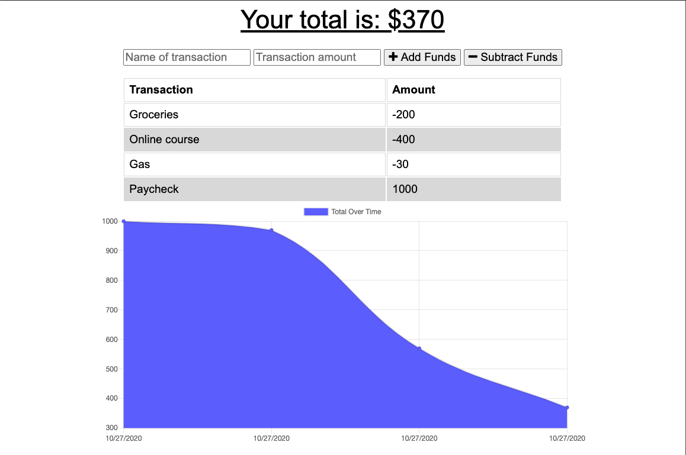

# budget-tracker-tool

  ## The Repository
  Link to repository: https://github.com/awebb8/budget-tracker-tool
  Link to deployed site: https://alix-budget-tracker.herokuapp.com/

  ## About
  The Budget Tracker application allows for offline access and functionality.  The application allows the user to add expenses and deposits to their budget with or without a connection.  Giving users a fast and easy way to track their money is important, but allowing them to access that information anytime is even more important.

  

  ## Table of Contents
  * [Installation](#installation)
  * [Usage](#usage)

  ## Installation
  If viewing through the deployed application link, there is no need to install anything.  If you would like to clone the repository, then clone from the budget-tracker-tool repository on GitHub.  Once cloned, utilize "npm install" to install dependencies, including Express and Mongoose.  For more information on installing and using Express, visit https://expressjs.com/en/starter/installing.html.  For more information on installing and using Mongoose, visit https://www.npmjs.com/package/mongoose.

  ## Usage
  The user may enter deposits and expenses while online or offline.  When brought back online, the entries made while offline will be added to the user's transaction history.  When a deposit or expense occurs, the graph is updated to reflect the transaction.